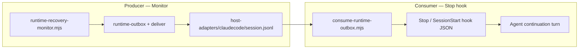

# Worker 2：Claude Code + Codex 主动唤醒接线方案

> 范围：插件可分发 hooks/monitors + outbox 消费 + continuation 注入  
> 依赖：Worker 1 将实现的 `scripts/consume-runtime-outbox.mjs`（本稿定义其契约与调用方式）  
> 产出日期：2026-07-01

---

## ① 结论（一句话）

**Claude Code 下午最靠谱路径：插件根 `monitors/monitors.json` 在 `on-skill-invoke:opentrons-experiment-goal` 时常驻跑 `runtime-recovery-monitor.mjs` 往 `claudecode` adapter 写 JSONL，再用 `hooks/hooks.json` 的 `Stop`（辅以 `SessionStart`）调用 `consume-runtime-outbox.mjs` 注入 continuation——Monitor 只产事件，Stop 才续跑。**

Codex 同一套 consume 脚本 + `Stop` hook；因 `plugin_hooks` 在部分版本默认关闭（[codex#17331](https://github.com/openai/codex/issues/17331)），**下午务必用 `install-labscriptai-ot.sh` 合并到 `~/.codex/hooks.json` 并 `/hooks` trust**。

---

## 架构：产 vs 消



| 组件 | 职责 | 单独使用是否够 |
|------|------|----------------|
| **Monitor** | 周期 tick → `publishMonitorNotifications` → `deliverToAdapter("claudecode")` 追加 JSONL | ❌ 仅通知，不强制续跑 |
| **Stop hook + consume** | 读 adapter/outbox 未消费行 → 输出 host 专用 continuation JSON | ❌ 无新事件时无唤醒源 |
| **二者组合** | 事件源 + 续跑注入 | ✅ 下午最短可跑通路径 |

**不选「仅 Monitor」**：Claude Monitor 把 stdout 行当 notification，Claude 可能看完仍结束 turn。  
**不选「仅 Stop」**：无 monitor/goal loop 时 adapter 邮箱为空，Stop 无内容可注入。

---

## host-adapters 路径（与 `runtime-outbox.js` 一致）

| 变量 | 默认 |
|------|------|
| `PLUGIN_DATA` / `OPENTRONS_PLUGIN_ROOT/.plugin-data` | 可写状态根 |
| `OPENTRONS_RUNTIME_HOST_ADAPTER_DIR` | `${PLUGIN_DATA}/host-adapters` |

| Adapter | 邮箱文件 |
|---------|----------|
| `claudecode` | `${PLUGIN_DATA}/host-adapters/claudecode/<session_id>.jsonl` |
| `codex` | `${PLUGIN_DATA}/host-adapters/codex/<session_id>.jsonl` |

每行格式（`deliverToAdapter` 写入）：

```json
{"delivered_at":"2026-07-01T12:00:00.000Z","adapter":"claudecode","event":{"outbox_id":"…","session_id":"self-recovery-liquid","type":"monitor_status_changed","message_zh":"…","recommended_next_tool":"safe_next_action","requires_attention":true,"no_robot_motion":true,"data":{}}}
```

消费状态建议（Worker 1）：`${PLUGIN_DATA}/host-adapters/<adapter>/<session_id>.consume-offset.json` 记录已读行号，避免重复 continuation。

---

## continuation prompt 模板（对齐 `opentrons-experiment-goal`）

`consume-runtime-outbox.mjs` 在检测到未消费事件时，将下列文本填入 host 的 continuation 字段（Claude 用 `reason` + `hookSpecificOutput.additionalContext`；Codex 用 `reason`）：

```text
[LabscriptAI OT Goal Wake]
Session: {session_id}  Run: {run_id_or_none}
Event: {event.type} — {event.message_zh || event.message}
Severity: {event.severity}  requires_attention={event.requires_attention}
Recommended tool: {event.recommended_next_tool || "runtime_get_outbox"}
no_robot_motion={event.no_robot_motion}

Follow skill opentrons-experiment-goal:
1. runtime_get_outbox(session_id="{session_id}", run_id={run_id_json}, limit=5)
2. If goal loop not armed: runtime_watch_loop(..., notify_adapters=["claudecode"], self_fix_mode="observe")
3. Branch on goal_status / alert severity
4. Print exactly one status line:
   GOAL_STATUS: CONTINUE | COMPLETE | BLOCKED
   GOAL_REASON: <one line>
5. On COMPLETE: runtime_ack_outbox(outbox_id="{outbox_id}")

Safety: hard_stop → BLOCKED, do not auto-retry. Liquid recovery → live_liquid_recovery_gate + operator opt-in.
```

**Claude Stop 输出示例**（有待处理事件且 `stop_hook_active !== true`）：

```json
{
  "decision": "block",
  "reason": "[LabscriptAI OT Goal Wake] …（同上模板全文）",
  "hookSpecificOutput": {
    "hookEventName": "Stop",
    "additionalContext": "Pending runtime outbox event {outbox_id}. Execute opentrons-experiment-goal wake protocol."
  }
}
```

**无待处理事件**：exit 0，stdout 空或 `{}`，允许正常 Stop。

**Codex Stop 输出示例**：

```json
{
  "decision": "block",
  "reason": "[LabscriptAI OT Goal Wake] …（同上模板全文）"
}
```

Codex 文档：`decision: "block"` 在 Stop 事件上会**继续 turn** 并把 `reason` 当作新 user prompt（[developers.openai.com/codex/hooks#stop](https://developers.openai.com/codex/hooks)）。

---

## ② Claude Code：`hooks/hooks.json` + `monitors/monitors.json` 完整示例

> **打包位置**：必须在**插件根目录**，与 `.claude-plugin/` 平级（[plugins reference](https://code.claude.com/docs/en/plugins-reference)）。  
> `hooks/`、`monitors/` **不要**放进 `.claude-plugin/`。  
> 变量：`${CLAUDE_PLUGIN_ROOT}`、`${CLAUDE_PLUGIN_DATA}`（等同 `PLUGIN_DATA` 可写目录）。

### `hooks/hooks.json`（插件根）

```json
{
  "description": "LabscriptAI OT — consume runtime outbox and inject goal continuation",
  "hooks": {
    "SessionStart": [
      {
        "matcher": "*",
        "hooks": [
          {
            "type": "command",
            "command": "cd \"${CLAUDE_PLUGIN_ROOT}\" && OPENTRONS_PLUGIN_ROOT=\"${CLAUDE_PLUGIN_ROOT}\" PLUGIN_DATA=\"${CLAUDE_PLUGIN_DATA}\" node scripts/consume-runtime-outbox.mjs --host claudecode --hook-event SessionStart --session-id \"${OPENTRONS_SESSION_ID:-self-recovery-liquid}\"",
            "timeout": 15
          }
        ]
      }
    ],
    "UserPromptSubmit": [
      {
        "matcher": "*",
        "hooks": [
          {
            "type": "command",
            "command": "cd \"${CLAUDE_PLUGIN_ROOT}\" && OPENTRONS_PLUGIN_ROOT=\"${CLAUDE_PLUGIN_ROOT}\" PLUGIN_DATA=\"${CLAUDE_PLUGIN_DATA}\" node scripts/consume-runtime-outbox.mjs --host claudecode --hook-event UserPromptSubmit --session-id \"${OPENTRONS_SESSION_ID:-self-recovery-liquid}\"",
            "timeout": 15
          }
        ]
      }
    ],
    "Stop": [
      {
        "matcher": "*",
        "hooks": [
          {
            "type": "command",
            "command": "cd \"${CLAUDE_PLUGIN_ROOT}\" && OPENTRONS_PLUGIN_ROOT=\"${CLAUDE_PLUGIN_ROOT}\" PLUGIN_DATA=\"${CLAUDE_PLUGIN_DATA}\" node scripts/consume-runtime-outbox.mjs --host claudecode --hook-event Stop --session-id \"${OPENTRONS_SESSION_ID:-self-recovery-liquid}\"",
            "timeout": 20
          }
        ]
      }
    ]
  }
}
```

### `monitors/monitors.json`（插件根）

```json
[
  {
    "name": "labscriptai-runtime-outbox-publisher",
    "description": "Ticks runtime_recovery_monitor and delivers to claudecode adapter mailbox",
    "when": "on-skill-invoke:opentrons-experiment-goal",
    "command": "cd \"${CLAUDE_PLUGIN_ROOT}\" && export OPENTRONS_PLUGIN_ROOT=\"${CLAUDE_PLUGIN_ROOT}\" PLUGIN_DATA=\"${CLAUDE_PLUGIN_DATA}\" OPENTRONS_SESSION_ID=\"${OPENTRONS_SESSION_ID:-self-recovery-liquid}\" OPENTRONS_ROBOT_IP=\"${OPENTRONS_ROBOT_IP:-}\" && node scripts/runtime-recovery-monitor.mjs --session-id \"$OPENTRONS_SESSION_ID\" ${OPENTRONS_ROBOT_IP:+--robot-ip \"$OPENTRONS_ROBOT_IP\"} --cycles 240 --interval-ms 30000 --notify-adapters claudecode --host-adapter-dir \"$PLUGIN_DATA/host-adapters\" --out \"$PLUGIN_DATA/runtime-recovery-monitor-latest.json\" --markdown-out \"$PLUGIN_DATA/runtime-recovery-monitor-latest.md\""
  }
]
```

### 可选：`plugin.json` 显式声明 monitors

```json
{
  "experimental": {
    "monitors": "./monitors/monitors.json"
  }
}
```

### Claude 约束备忘

| 项 | 说明 |
|----|------|
| Monitor 可用性 | **仅 interactive CLI**；VS Code 扩展 / Cloud 无 Monitor（[plugins reference — Monitors](https://code.claude.com/docs/en/plugins-reference)） |
| 版本 | Monitor 需 Claude Code **≥ v2.1.105** |
| VS Code Hook | 插件内 `hooks.json` 在 VS Code 扩展有加载不一致报告（[claude-code#18547](https://github.com/anthropics/claude-code/issues/18547)）——**下午演示请用 CLI** |
| 热更新 | 改 `hooks/`、`monitors/` 后需 `/reload-plugins` 或重启会话 |
| 防死循环 | consume 在 stdin 里若见 `stop_hook_active: true` 应 exit 0 空输出 |

---

## ③ Codex：`hooks/hooks.json` 完整示例

### 插件内 `hooks/hooks.json`（与 Claude 共用 consume，改 `--host codex`）

```json
{
  "hooks": {
    "SessionStart": [
      {
        "hooks": [
          {
            "type": "command",
            "command": "cd \"${PLUGIN_ROOT}\" && OPENTRONS_PLUGIN_ROOT=\"${PLUGIN_ROOT}\" PLUGIN_DATA=\"${PLUGIN_DATA}\" node scripts/consume-runtime-outbox.mjs --host codex --hook-event SessionStart --session-id \"${OPENTRONS_SESSION_ID:-self-recovery-liquid}\""
          }
        ]
      }
    ],
    "UserPromptSubmit": [
      {
        "hooks": [
          {
            "type": "command",
            "command": "cd \"${PLUGIN_ROOT}\" && OPENTRONS_PLUGIN_ROOT=\"${PLUGIN_ROOT}\" PLUGIN_DATA=\"${PLUGIN_DATA}\" node scripts/consume-runtime-outbox.mjs --host codex --hook-event UserPromptSubmit --session-id \"${OPENTRONS_SESSION_ID:-self-recovery-liquid}\""
          }
        ]
      }
    ],
    "Stop": [
      {
        "hooks": [
          {
            "type": "command",
            "command": "cd \"${PLUGIN_ROOT}\" && OPENTRONS_PLUGIN_ROOT=\"${PLUGIN_ROOT}\" PLUGIN_DATA=\"${PLUGIN_DATA}\" node scripts/consume-runtime-outbox.mjs --host codex --hook-event Stop --session-id \"${OPENTRONS_SESSION_ID:-self-recovery-liquid}\""
          }
        ]
      }
    ]
  }
}
```

### `.codex-plugin/plugin.json` 追加

```json
{
  "hooks": "./hooks/hooks.json"
}
```

### Codex 已知缺口与 fallback

| 问题 | 现状 | 下午做法 |
|------|------|----------|
| [codex#17331](https://github.com/openai/codex/issues/17331) 插件 manifest hooks 未进运行时 | PR [#19705](https://github.com/openai/codex/pull/19705) 在 `plugin_hooks` feature flag 后修复 | **不赌插件内 hooks**；安装脚本合并到 `~/.codex/hooks.json` |
| `plugin_hooks` 默认 | Codex CLI 0.130.0 上 `codex features list` 显示 **under development / false** | 用户级 hooks + `/hooks` review & trust |
| 环境变量 | 插件 hook 命令有 `PLUGIN_ROOT`、`PLUGIN_DATA`、`CLAUDE_PLUGIN_ROOT` 兼容 | consume 脚本同时读 `OPENTRONS_PLUGIN_ROOT` / `PLUGIN_ROOT` |
| 路径 | 应用 `git rev-parse` 或安装脚本写入**绝对路径**到 user hooks | 见下方 install 补丁 |

### 用户级 `~/.codex/hooks.json` fallback 片段（安装脚本生成）

安装脚本应把 `command` 里的 `${PLUGIN_ROOT}` 替换为**克隆绝对路径**（user 层不保证有 `PLUGIN_ROOT` 替换）：

```json
{
  "hooks": {
    "Stop": [
      {
        "hooks": [
          {
            "type": "command",
            "command": "cd \"/ABS/PATH/TO/labscriptai-ot\" && OPENTRONS_PLUGIN_ROOT=\"/ABS/PATH/TO/labscriptai-ot\" PLUGIN_DATA=\"/ABS/PATH/TO/labscriptai-ot/.plugin-data\" node scripts/consume-runtime-outbox.mjs --host codex --hook-event Stop --session-id \"${OPENTRONS_SESSION_ID:-self-recovery-liquid}\""
          }
        ]
      }
    ]
  }
}
```

Operator 首次：`codex` → `/hooks` → trust 新 hook → 可选 `codex features enable plugin_hooks`（若版本支持）。

### Codex 无 Monitor

Codex **没有** Claude 式 plugin Monitor。发布侧二选一：

1. **推荐**：在 Claude/Codex 共用终端或 CI 跑 `runtime-recovery-monitor.mjs --notify-adapters codex`（见 §④）  
2. Agent 会话内 MCP `runtime_watch_loop(notify_adapters=["codex"])` 产 sentinel，Stop hook 只负责消费

---

## ④ consume 与 `runtime-recovery-monitor.mjs` 启动命令（copy-paste）

### Worker 1：`consume-runtime-outbox.mjs` 契约（待实现）

```bash
# Claude Stop（hook 内部调用，也可手动测）
cd /path/to/labscriptai-ot
export OPENTRONS_PLUGIN_ROOT="$PWD"
export PLUGIN_DATA="$PWD/.plugin-data"
export OPENTRONS_SESSION_ID="self-recovery-liquid"

node scripts/consume-runtime-outbox.mjs \
  --host claudecode \
  --hook-event Stop \
  --session-id "$OPENTRONS_SESSION_ID"

# Codex 同理 --host codex
# 可选：--source adapter|mcp（adapter=tail JSONL；mcp=直调 runtime_get_outbox handler）
# 可选：--dry-run（打印 prompt 不输出 hook JSON）
```

**预期行为**：
- 读 `${PLUGIN_DATA}/host-adapters/<host>/<session_id>.jsonl` 自上次 offset 起的新行
- 过滤 `event.requires_attention === true` 或 goal-watch sentinel（`event.data.notification` / `event.type` 含 `goal`）
- 输出 host 专用 JSON 到 stdout；成功后推进 offset，并可选调 MCP `runtime_ack_outbox`（`--ack` 默认开）

### 发布：向 Claude adapter 写邮箱（Monitor 进程）

```bash
cd /path/to/labscriptai-ot
export OPENTRONS_PLUGIN_ROOT="$PWD"
export PLUGIN_DATA="$PWD/.plugin-data"
export OPENTRONS_SESSION_ID="self-recovery-liquid"
export OPENTRONS_ROBOT_IP="192.168.66.102"   # 无机器人可省略

node scripts/runtime-recovery-monitor.mjs \
  --session-id "$OPENTRONS_SESSION_ID" \
  --robot-ip "$OPENTRONS_ROBOT_IP" \
  --source-plan c3_d3_liquid_recovery \
  --enable-liquid-gate \
  --levels L1,L3 \
  --cycles 20 \
  --interval-ms 30000 \
  --notify-adapters claudecode \
  --host-adapter-dir "$PLUGIN_DATA/host-adapters" \
  --out "$PLUGIN_DATA/runtime-recovery-monitor-latest.json" \
  --markdown-out "$PLUGIN_DATA/runtime-recovery-monitor-latest.md"
```

### 发布：同时喂 Claude + Codex

```bash
node scripts/runtime-recovery-monitor.mjs \
  --session-id "$OPENTRONS_SESSION_ID" \
  --robot-ip "$OPENTRONS_ROBOT_IP" \
  --run-id "<run-id>" \
  --cycles 120 \
  --interval-ms 30000 \
  --notify-adapters claudecode,codex \
  --host-adapter-dir "$PLUGIN_DATA/host-adapters" \
  --out runs/self-recovery/artifacts/runtime-recovery-monitor-latest.json \
  --markdown-out runs/self-recovery/artifacts/runtime-recovery-monitor-latest.md
```

### 无机器人烟雾测（下午可先跑）

```bash
node scripts/runtime-recovery-monitor.mjs \
  --session-id self-recovery-liquid \
  --cycles 3 \
  --interval-ms 5000 \
  --notify-adapters claudecode,cli \
  --host-adapter-dir "$PLUGIN_DATA/host-adapters" \
  --out "$PLUGIN_DATA/smoke-monitor.json"

# 检查邮箱
tail -3 "$PLUGIN_DATA/host-adapters/claudecode/self-recovery-liquid.jsonl"

# 测 consume（Worker 1 落地后）
node scripts/consume-runtime-outbox.mjs --host claudecode --hook-event Stop --session-id self-recovery-liquid --dry-run
```

### Goal loop 产 sentinel（Agent 在会话内 MCP 调用）

```text
runtime_watch_loop(
  run_id="<run-id>",
  session_id="self-recovery-liquid",
  goal_prompt="盯到跑完；hard_stop 停；液体 recovery 走 gate",
  max_turns=20,
  max_runtime_ms=600000,
  interval_ms=5000,
  self_fix_mode="observe",
  notify_adapters=["claudecode"]
)
```

---

## ⑤ `install-labscriptai-ot.sh` 补丁草案

在现有 `npm install` + `verify-setup.mjs` 之后追加（**不默认覆盖**已有 user hooks，用 merge）：

```bash
# --- host hook wiring (optional, idempotent) ---
HOOKS_SRC="$PLUGIN_ROOT/hooks"
INSTALL_HOOKS="${LABSCRIPTAI_INSTALL_HOST_HOOKS:-1}"

if [[ "$INSTALL_HOOKS" == "1" && -d "$HOOKS_SRC" ]]; then
  # Codex user-level fallback (plugin_hooks may be off)
  if [[ -d "$HOME/.codex" || "${LABSCRIPTAI_FORCE_CODEX_HOOKS:-0}" == "1" ]]; then
    mkdir -p "$HOME/.codex"
    node "$PLUGIN_ROOT/scripts/install-codex-hooks.mjs" \
      --plugin-root "$PLUGIN_ROOT" \
      --source "$HOOKS_SRC/codex/hooks.json" \
      --target "$HOME/.codex/hooks.json" \
      --merge
    echo "Codex: merged outbox hooks into ~/.codex/hooks.json — run 'codex' then '/hooks' to trust."
  fi

  # Claude Code: plugin-bundled hooks/ + monitors/ at repo root load on /plugin install.
  # Optional user merge only if VS Code extension fails to load plugin hooks:
  if [[ "${LABSCRIPTAI_CLAUDE_USER_HOOKS:-0}" == "1" ]]; then
    mkdir -p "$HOME/.claude"
    node "$PLUGIN_ROOT/scripts/install-claude-hooks.mjs" \
      --plugin-root "$PLUGIN_ROOT" \
      --target "$HOME/.claude/settings.json" \
      --merge
    echo "Claude: merged hooks into ~/.claude/settings.json (fallback)."
  fi

  cat <<'HOOKS_EOF'

Host wake wiring:
  Claude Code CLI: enable plugin → hooks/hooks.json + monitors/monitors.json auto-load.
                   Set OPENTRONS_SESSION_ID / OPENTRONS_ROBOT_IP in shell or plugin env.
  Codex:           ~/.codex/hooks.json merged — trust via /hooks.
  Smoke test:      node scripts/runtime-recovery-monitor.mjs --notify-adapters claudecode,codex --cycles 3 ...
HOOKS_EOF
fi
```

**建议新增脚本**（Worker 1/3 实现）：

| 脚本 | 作用 |
|------|------|
| `scripts/install-codex-hooks.mjs` | 深度合并 `hooks.Stop` 等；`command` 写绝对 `PLUGIN_ROOT`；保留用户已有 hooks |
| `scripts/install-claude-hooks.mjs` | 可选：把 plugin hooks 片段 merge 进 `~/.claude/settings.json` |
| `scripts/consume-runtime-outbox.mjs` | 统一消费 + hook JSON 输出 |

**环境变量约定**（安装说明打印）：

```bash
export OPENTRONS_PLUGIN_ROOT="/path/to/labscriptai-ot"
export PLUGIN_DATA="/path/to/labscriptai-ot/.plugin-data"
export OPENTRONS_SESSION_ID="self-recovery-liquid"
export OPENTRONS_ROBOT_IP="192.168.66.102"   # 可选
```

---

## ⑥ 与 Cursor 方案的差异表

| 维度 | **Claude Code（本稿）** | **Codex（本稿）** | **Cursor（Worker 1 / 04 调研）** |
|------|-------------------------|-------------------|----------------------------------|
| **事件生产者** | Plugin **Monitor**（`on-skill-invoke:opentrons-experiment-goal`）+ 可选外置 `runtime-recovery-monitor.mjs` | 无 Monitor；外置 monitor CLI 或 MCP `runtime_watch_loop` | `runtime-recovery-monitor.mjs` 或 MCP goal loop；可用 **background shell** |
| **事件消费者** | `hooks/hooks.json` → **Stop** + consume 脚本 | `~/.codex/hooks.json` **Stop**（user fallback）+ 同 consume | `.cursor/hooks.json` **stop** / **sessionStart** 或内置 **`/loop`** skill |
| **续跑机制** | Stop `decision:block` + `hookSpecificOutput.additionalContext`（v2.1.163+） | Stop `decision:block` → `reason` 变新 user prompt | `/loop` 定时间隔发 prompt；或 stop hook 注入 `followup_message` |
| **插件内打包** | `hooks/` + `monitors/` 在**插件根**，marketplace 安装即加载 | `hooks/hooks.json` + manifest `hooks` 字段（**运行时可能不加载**） | `hooks/cursor/hooks.json` + `${CURSOR_PLUGIN_ROOT}` |
| **安装脚本兜底** | 默认靠插件；`LABSCRIPTAI_CLAUDE_USER_HOOKS=1` 合并 settings | **必须** merge `~/.codex/hooks.json` + `/hooks` trust | 依赖 marketplace 插件或项目 `.cursor/hooks.json` symlink |
| **adapter 邮箱** | `.plugin-data/host-adapters/claudecode/<session>.jsonl` | `…/codex/<session>.jsonl` | `…/cursor/<session>.jsonl` |
| **consume 脚本** | `--host claudecode` | `--host codex` | `--host cursor`（输出 Cursor stop hook schema） |
| **下午演示优先级** | **CLI 会话** + Monitor + Stop | user hooks + 外置 monitor | `/loop` 最短；Hook 次之 |
| **Cloud / 非交互** | Monitor **不可用** | 依产品形态；hooks 可 managed | **Cloud Automations** 可 webhook→Automation |
| **已知风险** | VS Code 插件 Hook 不全；Monitor 仅 CLI | `plugin_hooks` 默认关 | 长间隔 `/loop` background shell bug |

---

## 下午 Claude Code 3 步跑通清单

1. **安装与插件**  
   ```bash
   cd /path/to/labscriptai-ot && bash install-labscriptai-ot.sh
   export OPENTRONS_PLUGIN_ROOT="$PWD" PLUGIN_DATA="$PWD/.plugin-data" OPENTRONS_SESSION_ID="self-recovery-liquid"
   ```  
   Claude **CLI**：`/plugin install` 本仓 → 确认 Worker 1 已落地 `hooks/`、`monitors/`、`consume-runtime-outbox.mjs` → 新开会话。

2. **产事件**  
   对用户说：*「用 opentrons-experiment-goal 盯 session self-recovery-liquid」*（触发 Monitor）**或**另开终端跑 §④ monitor 命令。  
   验证：`tail -1 "$PLUGIN_DATA/host-adapters/claudecode/self-recovery-liquid.jsonl"` 有输出。

3. **消事件 + 续跑**  
   等 Claude 一轮结束 → **Stop hook** 调 consume → 应出现带 `GOAL_STATUS` 的 continuation。  
   手动：`node scripts/consume-runtime-outbox.mjs --host claudecode --hook-event Stop --session-id self-recovery-liquid`

---

## 参考

- 仓内：`runs/qa-2026-07-01/04-hooks-proactive-reminder.md`、`skills/opentrons-experiment-goal/SKILL.md`、`servers/opentrons-mcp/lib/runtime-outbox.js`
- Claude：[Hooks](https://code.claude.com/docs/en/hooks)、[Plugins / Monitors](https://code.claude.com/docs/en/plugins-reference)
- Codex：[Hooks](https://developers.openai.com/codex/hooks)、[Build plugins](https://developers.openai.com/codex/plugins/build)、[#17331](https://github.com/openai/codex/issues/17331)

---

*产出路径：`runs/outbox-wake/02-claudecode-codex.md`*
