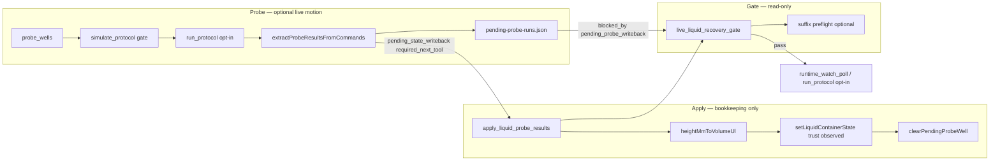

# 本地探针 / 液面检测 / pLLD stack 盘点（对比 worker）

**对比基准：** 本地工作区当前状态（含未提交：三把锁、`apply_liquid_probe_results` MCP、`heightMmToVolumeUl`、outbox wake 等）  
**对照分支：** `origin/feature/flex-liquid-presence-detection`（见 [`09a-probe-branch-remote.md`](09a-probe-branch-remote.md)）  
**调研日期：** 2026-07-02  
**方法：** 只读源码 + `node --test` + `runs/self-recovery` artifact 清点；**未改源码、未 commit**

---

## 一句话

本地 stack 是 **V2-plumbing 取向的 Flex pLLD 闭环**：`probe_wells`（三模式、simulate-first、真机 opt-in）→ **强制** `apply_liquid_probe_results`（`trust_level:"observed"` + `heightMmToVolumeUl`）→ `live_liquid_recovery_gate`（`pending_probe_writeback` + suffix 预检）；相对远程分支 **缺 batch apply / `observed_height_mm` / `auto_apply_to_session` / runbook 与 Flex LPD 验收协议**，但 **多 height→volume、信任单调与 pending 写回闸门**。

---

## 功能清单

### 协议与解析层（`servers/opentrons-mcp/lib/probe.js`）

| 导出 / 能力 | 说明 |
|---|---|
| `buildProbeWellsProtocol` | 生成临时 Flex 协议（apiLevel 2.24，`liquid_presence_detection=True`）；三模式映射 Opentrons API |
| `extractProbeResultsFromCommands` | 从 `/runs/{id}/commands` 的 `PROBE_RESULT:` comment 解析 JSON |
| `heightMmToVolumeUl` | **本地新增（+276 行）** — 圆柱/圆锥/分段孔几何近似 → `{ volume_ul, method, confidence, notes }` |
| `lookupLabwareGeometry` | 5 种常见 96 孔板近似几何表（`APPROXIMATE_LABWARE_GEOMETRY`） |
| `enrichProbeResultsForWriteback`（`index.js`） | 为 apply 预填 `slot_name`、`height_mm` / `observed_presence` |

**三探针模式（Opentrons Flex 电容 LPD）：**

| `mode` | Python API | `PROBE_RESULT.value` |
|---|---|---|
| `detect_presence`（默认） | `pipette.detect_liquid_presence(well)` | `bool` |
| `require_presence` | `pipette.require_liquid_presence(well)` | 成功 → `true` |
| `measure_height` | `pipette.measure_liquid_height(well)` | `float` mm（相对孔底） |

其他协议选项：`starting_tip`（重复探针时从已知新 tip 起）、`trash_slot` 自动避让已占 slot。

### MCP 工具

| 工具 | 层级 | 本地行为要点 |
|---|---|---|
| **`probe_wells`** | L3 | 默认 **仅 simulate**；`execute_on_robot=true` 需 `OPENTRONS_ENABLE_PROBE_WELLS=1` + `robot_ip` + simulate pass；真机成功后返回 `pending_state_writeback: true`、`required_next_tool: "apply_liquid_probe_results"`、`probe_results`（enriched） |
| **`apply_liquid_probe_results`** | L3 | **单孔**写回 Virtual Lab State：`setLiquidContainerState` → `trust_level:"observed"`；支持 `actual_volume_ul`、`height_mm`（经 `heightMmToVolumeUl`）、`observed_presence`；`canOverwriteTrust` 防降级（`force` 逃逸）；`clearPendingProbeWell` |
| **`live_liquid_recovery_gate`** | L2 | 只读 go/no-go；检查项含 `pending_probe_writeback`、`suffix_plan_not_sufficient`、`allow_observed_mismatch_reprobe` 等；返回 `resolution_plan` / `operator_request` |
| **`record_liquid_source_map`** 等 | L2 | 操作员声明 `expected_presence`；与 observed 分离 |
| **`load_pipette`** | L3 | `liquid_presence_detection` 参数（非独立 pLLD 工具） |
| **`drop_attached_tip`** | L3 | tip 清理（液体恢复前置条件） |

**持久化 pending 写回（`PLUGIN_DATA/pending-probe-runs/<session>.json`）：**

- `recordPendingProbeRun` — 真机 `probe_wells` 后登记未 apply 的 well 列表  
- `getPendingProbeWritebackWells` — gate 读取  
- `clearPendingProbeWell` — `apply_liquid_probe_results` 成功后标记 applied  

`PROBE_STATE_WRITEBACK_MODES` = `{ detect_presence, require_presence, measure_height }`（三种模式均触发 pending）。

### Virtual Lab State / 信任（`servers/opentrons-mcp/lib/state.js`）

| 能力 | 说明 |
|---|---|
| `LIQUID_TRUST_LEVELS` | `declared` < `simulated` < `observed` < `reconciled` |
| `TRUST_LEVEL_RANK` / `canOverwriteTrust` | 单调信任；阻止 observed 被 simulate 覆盖 |
| `setLiquidContainerState` | apply 写回入口；推断 `trust_level`（有 `observed_presence` → observed） |
| `setContainerVolume` | absolute/delta 模式 + `trust_downgrade_blocked` violation |

**本地 schema 有：** `observed_presence`、`observed_at`、`observed_run_id`、`observed_source`、`trust_level`、`volume_ul`、`expected_min_height_mm`  
**本地 schema 无（远程有）：** `observed_height_mm`、`observed_probe_mode`

### Suffix 与液体恢复（与探针 gate 串联）

| 模块 | 角色 |
|---|---|
| `lib/suffix-monitor.js` | `evaluateSuffixSufficiency` — 错误步后缀 Virtual Lab State 重放；`applyRecoveryPatchToSteps` |
| `live_liquid_recovery_gate` | 可选 `recovery_steps` + `error_step_index` → suffix 预检 → `final_auto_resume_eligible` |
| `lib/liquid-source-substitution.js` | `setSuffixSufficiencyOnPlan`；换源 recovery 与 gate 联动 |
| `lib/runtime-monitor.js` | 液体失败 → `live_liquid_recovery_gate` 推荐下一工具 |

### CLI（`scripts/apply-liquid-probe-results.mjs`）

- 从 probe artifact JSON 批量读 `probe_results`  
- **当前仍走旧路径：** 直接 `TOOL_HANDLERS.record_liquid_source_map` + `summarize_liquid_source_map`  
- **未调用** MCP `apply_liquid_probe_results` → **不写 `trust_level:"observed"` / 不做 height→volume**  
- 与 `docs/GETTING_STARTED.md` 真机 follow-up 步骤一致，但与 MCP V2 writeback **双轨**

### 文档（探针相关段落）

| 文档 | 本地内容 |
|---|---|
| `docs/MCP_TOOLS.md` | L3 `apply_liquid_probe_results`（单孔、height/volume、gate `pending_probe_writeback`）；L3 `probe_wells` writeback 契约 |
| `docs/ROADMAP-virtual-lab.md` | Phase V2-plumbing 仍标 **in progress**（代码已大部分落地） |
| `docs/GETTING_STARTED.md` | 真机 gate、`starting_tip`、`apply-liquid-probe-results.mjs`、`--allow-observed-mismatch-reprobe` |
| `docs/GLOSSARY.md` | Probe wells 定义、`OPENTRONS_ENABLE_PROBE_WELLS` |

**本地无：** `docs/runbooks/probe-wells-live-validation.md`、protocol-author Flex LPD 参考、`automation/new/protocol_flex_lpd_*.py`（均在远程分支）

---

## 工具链：probe → apply → gate



**标准序列（本地设计意图）：**

1. `live_liquid_recovery_gate` — 确认 tip/门/estop/source map（可选 suffix 预检）  
2. `probe_wells` — simulate →（opt-in）真机 → 得到 `probe_results` + `pending_state_writeback`  
3. **`apply_liquid_probe_results`** — 每孔写回（或逐 well 调用）；pending 清除  
4. 再次 `live_liquid_recovery_gate` — 方可继续 watcher / 换源 / 受限 reprobe  
5. （换源场景）suffix 通过 → `final_auto_resume_eligible`  

**与远程差异：** 远程允许 `auto_apply_to_session` 在步骤 2 末尾自动 batch apply；本地 **禁止** 探针后 unattended 续跑，直到显式 apply + gate pass。

---

## 测试覆盖

### 探针 / writeback / gate 专用测试

| 文件 | 覆盖点 | 用例数（约） |
|---|---|---|
| `test/probe-wells.test.js` | 协议生成三模式、`starting_tip`、comment 解析、simulate 默认、live opt-in 拒绝/成功、experiment_history | 6 |
| `test/probe-height-volume.test.js` | `heightMmToVolumeUl` 圆柱/圆锥/分段/unknown/clamp/`lookupLabwareGeometry` | 7 |
| `test/apply-liquid-probe-results-mcp.test.js` | MCP 注册、explicit volume、presence-only、height 转换、**pending gate block/clear**、suffix pass/fail in gate | 7 |
| `test/live-liquid-recovery-gate.test.js` | gate 注册、attached tip、source map、identity、c3_d3 plan、observed mismatch reprobe | 12+ |
| `test/suffix-monitor.test.js` | `evaluateSuffixSufficiency`、patch、violations | 多组 |
| `test/suffix-e2e-scenario.test.js` | **三把锁 E2E**：lock1 trust、lock2 probe→apply→gate、lock3 suffix、编排 | 5 |
| `test/state.test.js` | `canOverwriteTrust`、`setContainerVolume` absolute 防降级 | 含 lock1 |

### 全量测试结果（2026-07-02 本地执行）

```bash
cd servers/opentrons-mcp && node --test
# → 300 pass / 0 fail

cd servers/opentrons-mcp && node --test \
  test/probe-wells.test.js \
  test/probe-height-volume.test.js \
  test/apply-liquid-probe-results-mcp.test.js \
  test/live-liquid-recovery-gate.test.js
# → 34 pass / 0 fail
```

| 套件 | 结果 | 备注 |
|---|---|---|
| **全量 `node --test`** | **300 / 300 PASS** | 与 [`07-acceptance-outbox-wake-gpt55.md`](07-acceptance-outbox-wake-gpt55.md) 一致；[`06-acceptance-glm.md`](06-acceptance-glm.md) 记载的 lock2 E2E 失败 **已修复** |
| 探针聚焦子集 | 34 / 34 PASS | — |
| `node scripts/verify-setup.mjs` | 19 pass, 1 warning | vision deps 未装（与探针无关） |

**测试缺口：**

- `probe_wells` 真机分支 **未单测** `pending_state_writeback` / `recordPendingProbeRun` 字段（仅 apply+gate 集成测覆盖 pending 文件）  
- CLI `apply-liquid-probe-results.mjs` **无** 针对 MCP writeback 路径的测试  
- 无远程式 `apply-liquid-probe-results.test.js`（`liquid-probe-results.js` 模块测）

---

## 真机证据

| 来源 | 路径 / 内容 | 与本地 stack 关系 |
|---|---|---|
| **液体地图探针 run** | `runs/self-recovery/artifacts/liquid-map-probe-results.json` | run `d633ed17…`；C3/D3 多孔 `presence_value` + `height_value` mm（2026-06-22） |
| **D3 首列 live probe + apply** | `apply-liquid-probe-results-d3-first-column-latest.json` | 8 well `observed_presence:true`；**CLI 旧路径**（无 `trust_level`） |
| **C3.A1 / D3.H1 reprobe** | `apply-liquid-probe-results-c3-a1-latest.json`、`apply-liquid-probe-results-d3h1-reprobe-latest.json` | 换源 / mismatch 证据收集 |
| **液体失败 replay** | `liquid-failure-replay-d3a1-*`、`liquid-failure-replay-d3h1-*` | gate + playbook 手off 回归 |
| **综合报告** | `runs/self-recovery/2026-06-22-liquid-runtime-recovery-report.md` | Flex `192.168.66.102`；gate、source map、attached tip blocker |
| **触觉调研** | `runs/qa-2026-07-01/02-tactile-integration.md` | 术语与工具链对照（撰写时 CLI 尚无 MCP apply） |

**说明：** 真机 artifact 主要验证 **probe_wells / Opentrons LPD API + source-map observed_presence**；**`trust_level:"observed"` + `heightMmToVolumeUl` 写回** 目前以 **单元 / MCP 集成测** 为主，尚缺带日期的单页真机 V2 writeback 回归报告（ROADMAP「Real-machine V2 regression」仍 open）。

---

## 优点

| 维度 | 评价 |
|---|---|
| **Virtual Lab State 闭环** | 探针证据写入 `trust_level:"observed"` 与 `volume_ul`（可来自测高），符合 ROADMAP V2-plumbing 目标 |
| **强制写回闸门** | `pending_probe_writeback` + 三锁 E2E，防止「探了但没记账」就 resume |
| **信任单调** | `canOverwriteTrust` / lock1 防止 simulate 覆盖 observed |
| **测高→体积** | `heightMmToVolumeUl` 支持常见板型几何，供语义恢复与 suffix 体积校验 |
| **Gate 深度** | suffix 预检、`allow_observed_mismatch_reprobe`、resolution_plan 与中文 operator_request |
| **安全默认** | simulate-first、`OPENTRONS_ENABLE_PROBE_WELLS=1`、探针协议无 aspirate/dispense |
| **测试绿** | 全量 300/300；探针子集 34/34 |

---

## 缺点与风险

| 风险 | 说明 |
|---|---|
| **apply API 双轨** | MCP 单孔 VLS writeback vs CLI 批量 `record_liquid_source_map`；GETTING_STARTED 仍指引旧 CLI，真机 follow-up **可能绕过 trust/volume** |
| **无 `observed_height_mm` 字段** | 测高经 `heightMmToVolumeUl` 折成 `volume_ul`；原始 mm 不入库，审计/调试弱于远程 |
| **无 batch / auto apply** | 多孔探针需逐 well 调 MCP apply；无 `auto_apply_to_session` 便利开关 |
| **CLI 未接 MCP handler** | 与远程「CLI 薄封装 → `applyLiquidProbeResults`」相反 |
| **缺运营资产** | 无远程 runbook、Flex LPD 验收协议、protocol-author 参考 |
| **ROADMAP 滞后** | V2-plumbing 仍标 in progress；与代码/测试现状不符 |
| **仿真≠物理** | `require_presence` 空孔 simulate 可能仍 pass（远程 runbook 亦强调） |
| **Flex-only** | 全链依赖 Flex 电容 LPD；无 OT-2 路径 |

---

## 若只保留本地，相对远程会缺什么

（相对 [`09a-probe-branch-remote.md`](09a-probe-branch-remote.md) 远程 stack）

| # | 远程有、本地无 | 影响 |
|---|---|---|
| 1 | **`lib/liquid-probe-results.js`** | 共享 `resolveProbeContext` / `probeResultToSourceUpdate` / batch `applyLiquidProbeResults` |
| 2 | **Batch `apply_liquid_probe_results(probe_results[])`** | 一次 apply 多孔；artifact / `generated_protocol_path` 推断 slot |
| 3 | **`observed_height_mm` / `observed_probe_mode`** | session 保留原始测高与模式元数据 |
| 4 | **`probe_wells.auto_apply_to_session`** | 真机探针后可选自动写回（默认 false） |
| 5 | **CLI → MCP apply 薄封装** | 远程 `apply-liquid-probe-results.mjs` 调 handler；本地 CLI 仍内联 source-map |
| 6 | **`docs/runbooks/probe-wells-live-validation.md`** | 逐步真机验收表 |
| 7 | **`automation/new/protocol_flex_lpd_*.py`** | 硬件 validated 专用协议套件 |
| 8 | **protocol-author LPD 参考** | `liquid-presence-detection-flex.md` + `flex_liquid_probe_example.py` |
| 9 | **`test/apply-liquid-probe-results.test.js`** | 模块级 batch apply / slot 推断单测 |
| 10 | **`policy/workflows.md` Optional Flex liquid probe** | 标准工作流段落（远程 commit） |
| 11 | **技能链 LPD 指引** | `opentrons-experiment-run` / `opentrons-protocol-author` 增量（远程） |

**本地有、远程无（保留本地才保留）：** `heightMmToVolumeUl`、`trust_level:"observed"` 写回、`pending-probe-runs` + `pending_probe_writeback` gate、suffix 三锁 E2E、`probe-height-volume.test.js`、`apply-liquid-probe-results-mcp.test.js`（单孔模型）。

**合并提示（非本任务）：** 以远程 **batch apply + `observed_height_mm` + runbook** 为壳，迁入本地 **height→volume + trust + pending gate**；统一 `apply_liquid_probe_results` schema 并改 CLI 走 MCP handler。

---

## 关键文件索引（本地）

| 路径 | 角色 |
|---|---|
| `servers/opentrons-mcp/lib/probe.js` | 协议生成、结果解析、**height→volume** |
| `servers/opentrons-mcp/index.js` | `probe_wells`、`apply_liquid_probe_results`、`live_liquid_recovery_gate`、pending 文件、suffix gate |
| `servers/opentrons-mcp/lib/state.js` | 信任等级、`setLiquidContainerState` |
| `servers/opentrons-mcp/lib/suffix-monitor.js` | suffix 充分性（gate 预检） |
| `scripts/apply-liquid-probe-results.mjs` | CLI（**旧 source-map 路径**） |
| `docs/MCP_TOOLS.md` | L3 writeback 契约 |
| `docs/ROADMAP-virtual-lab.md` | V2-plumbing / suffix / Q2.1 |
| `runs/self-recovery/artifacts/*` | 2026-06-22/23 真机探针与 apply 产物 |

---

## 与远程 diff 规模（工作区 vs `origin/feature/flex-liquid-presence-detection`）

```
 scripts/apply-liquid-probe-results.mjs |  96 +++
 servers/opentrons-mcp/index.js         | 663 +++++++++++++
 servers/opentrons-mcp/lib/probe.js     | 276 +++++++++
 servers/opentrons-mcp/lib/state.js     |  87 +++
 4 files changed, ~984 insertions, ~138 deletions
```

远程 **独有** 文件（本地工作区无）：`lib/liquid-probe-results.js`、`test/apply-liquid-probe-results.test.js`、`docs/runbooks/probe-wells-live-validation.md`、`automation/new/protocol_flex_lpd_*.py` 等（见 09a）。
